 

<h1 align="center">Hi 👋, I'm Danda Hasta</h1>
<h3 align="center">A Passionate Full Stack Web Developer from Indonesia 🇮🇩</h3>

  

---

## 🚀 About Me

- 🎓 Student at **SMK N 1 Gianyar**
- 💻 Passionate about **Web Development**
- 🌱 Currently learning **React, Tailwind CSS & Laravel**
- 🎯 Goal: Build impactful web applications
- 📍 Bali, Indonesia

---

## 🛠 Tech Stack

### Frontend

### Backend

### Tools

---

##  Let's Work Together

<h1 align="center">
  ＣＯＮＮＥＣＴ
</h1>

  
  
  

  

## 📊 GitHub Statistics

    
  

 

---

<h2>🚀 PageSpeed Insights</h2>

🔗 **https://wahdanda.github.io/portofolio/**

  
  
  
  

## 📌 Featured Projects

| Project | Description |
|---------|-------------|
| 🌐 Portfolio Website | Personal portfolio built with React & Tailwind CSS |
| 🏕 Wedding Tent Rental | Landing page for wedding equipment rental |
| 💰 Financial App | Personal finance management application |
| 📱 More Projects | Coming Soon... |

---

## 🌐 Connect With Me

---

⭐ Thanks for visiting my profile!

